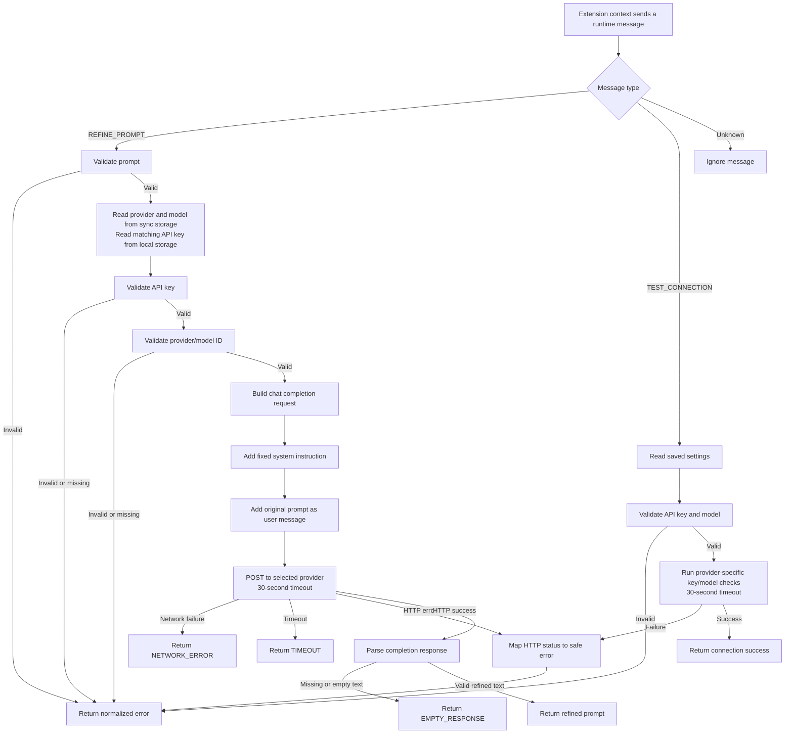
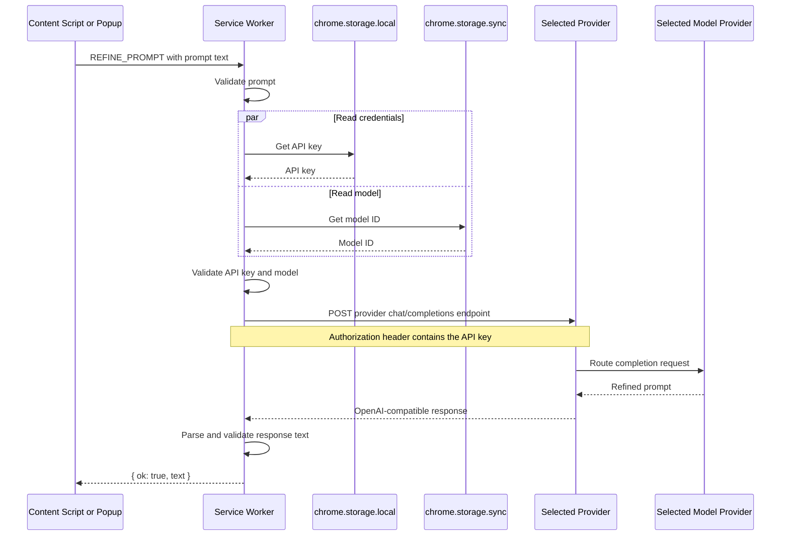
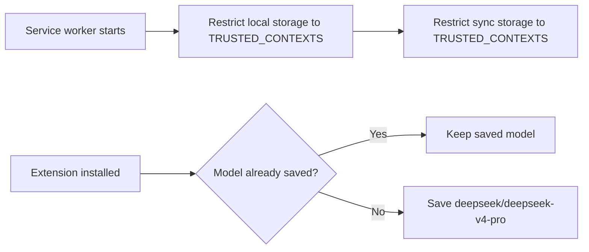
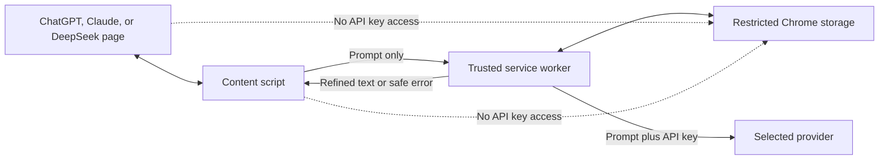

# Backend Flow

This document explains how the extension backend works. The backend is the Manifest V3 service worker in `background/service-worker.js`.

## Components

| Component | Responsibility |
| --- | --- |
| Content script | Reads and replaces prompts on supported websites. It never receives the API key. |
| Popup | Sends standalone prompts to the backend and displays the result. |
| Options page | Selects the provider, saves provider-specific keys/models, clears the active key, and requests connection tests. |
| Service worker | Reads active provider settings, validates requests, calls Vercel or OpenRouter, and normalizes responses. |
| LLM provider | Authenticates the active key and routes requests to the selected AI model. |

## Main Backend Flowchart



## Prompt Refinement Sequence



Both providers receive the same OpenAI-compatible request body:

```json
{
  "model": "deepseek/deepseek-v4-pro",
  "messages": [
    {
      "role": "system",
      "content": "Fixed prompt-refinement instruction"
    },
    {
      "role": "user",
      "content": "The user's current prompt"
    }
  ],
  "stream": false
}
```

The API key is added only to the request header:

```text
Authorization: Bearer <saved-api-key>
```

## Startup and Storage Flow



Storage is divided by purpose:

- `chrome.storage.local`: stores separate Vercel and OpenRouter API keys on the current device.
- `chrome.storage.sync`: stores the selected provider and separate provider models.
- `TRUSTED_CONTEXTS`: prevents content scripts from directly reading either storage area.

The content script sends only the prompt to the service worker. The service worker reads the key itself and never includes it in its response.

## Connection Test Flow

The Options page first saves the values currently displayed in the form. It then sends `TEST_CONNECTION` to the service worker.

For Vercel, the service worker:

1. Reads the saved API key and model.
2. Validates both values.
3. URL-encodes the model identifier.
4. Sends an authenticated request to:

   ```text
   GET https://ai-gateway.vercel.sh/v1/models/<provider>/<model>
   ```

5. Returns either the validated model ID or a normalized error.

For OpenRouter, it validates the key with `GET https://openrouter.ai/api/v1/key`, checks remaining key credits, and validates the model with `GET https://openrouter.ai/api/v1/model/<provider>/<model>`.

Neither connection test sends a user prompt or requests a model completion.

## Error Mapping

The backend converts implementation and provider errors into stable extension errors:

| Condition | Extension error |
| --- | --- |
| Empty prompt | `EMPTY_PROMPT` |
| Prompt exceeds 100,000 characters | `PROMPT_TOO_LONG` |
| Missing or malformed API key | `MISSING_API_KEY` or `INVALID_API_KEY` |
| Missing or malformed model ID | `MISSING_MODEL` or `INVALID_MODEL` |
| HTTP 401 or 403 | `AUTH_FAILED` |
| HTTP 402 | `BUDGET_EXHAUSTED` |
| HTTP 429 | `RATE_LIMITED` |
| HTTP 5xx | `GATEWAY_UNAVAILABLE` or `PROVIDER_UNAVAILABLE` |
| Request exceeds 30 seconds | `TIMEOUT` |
| Fetch fails | `NETWORK_ERROR` |
| Empty or malformed completion | `EMPTY_RESPONSE` |

User-facing messages never include the API key.

## Success and Failure Behavior

On success:

1. The service worker returns `{ ok: true, text }`.
2. The popup displays the refined prompt, or the content script replaces the website composer text.
3. The extension does not submit the website form.

On failure:

1. The service worker returns `{ ok: false, error }`.
2. The UI displays a concise recovery message.
3. The original website prompt remains unchanged.

The content script also checks whether the user edited the composer while the request was running. If the text changed, it preserves the newer text instead of replacing it with the completed result.

## Security Boundary



The primary backend security rule is that credentials remain inside trusted extension contexts. Supported websites and content scripts do not receive the API key.
